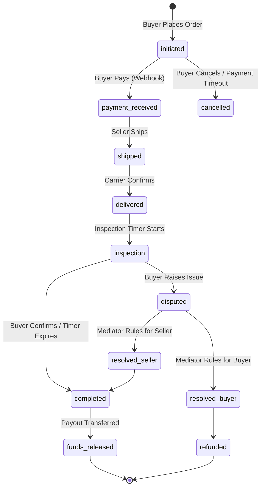

# Backend Design & Architecture Specification

This document outlines the domain-modular backend architecture, installed apps registry, database structures, and design patterns for the SafeTrade platform.

---

## 1. Modular Directory Structure & App Registry

The platform's features are organized inside domain-specific Django apps under the `apps/` directory.

### Local Django Apps Registry

| App Name | Config Class | Core Responsibility |
| :--- | :--- | :--- |
| **`apps.users`** | `UsersConfig` | Custom user models (`CustomUser`), profiles (`UserProfile`), addresses, and verification state. |
| **`apps.products`** | `ProductsConfig` | Unified product catalog: listing, categories, variants, search indexing, reviews, inventory, and watchlists. (See section 2). |
| **`apps.transactions`** | `TransactionsConfig` | Escrow transaction engine, state transitions, inspection period timers, and automated timeouts. |
| **`apps.disputes`** | `DisputesConfig` | Dispute resolution system for transactions that require platform mediator intervention. |
| **`apps.chat`** | `ChatConfig` | WebSocket-based real-time communication between buyers and sellers. |
| **`apps.notifications`** | `NotificationsConfig` | Unified notification dispatcher (email, SMS, and in-app alerts). |
| **`apps.flutterwave`** | `FlutterwaveConfig` | Payment processing gateway integration. |
| **`apps.comments`** | `CommentsConfig` | Public comments/questions on product listings. |
| **`apps.store`** | `StoreConfig` | Merchant store profiles and seller settings. |
| **`apps.categories`** | `CategoriesConfig` | Hierarchical catalog categories. |
| **`apps.monitoring`** | `MonitoringConfig` | API performance logging and system request tracking middleware. |
| **`apps.search`** | `SearchConfig` | Elasticsearch index query execution API endpoints. |
| **`apps.core`** | `CoreConfig` | Abstract base models (`BaseModel`), shared utilities, and cache managers. |

---

## 2. Product App Consolidation

To prevent circular dependencies and boilerplates, 13 previously fragmented sub-apps were collapsed into a single unified `apps.products` module:

```
apps/products/
├── admin.py                # Combined admin panel registrations
├── apps.py                 # App configuration & signal registrations
├── documents.py            # Elasticsearch index mappings and document classes
├── middleware.py           # Search log tracking and analytics middlewares
├── schema.py               # API schema documentation rules
├── urls.py                 # Combined viewset routers
├── models/                 # Database schema files
│   ├── base.py             # Product model
│   ├── brand.py            # Brand & BrandRequest models
│   ├── common.py           # Shared helper functions
│   ├── managers.py         # BrandQuerySet & BrandManager optimization helpers
│   ├── rating.py           # Product reviews & ratings
│   └── variant.py          # Variant options & pricing matrices
├── serializers/            # DRF serializer classes (base, brand, rating, variant)
├── views/                  # API endpoints (base, brand, search, watchlist, etc.)
├── services/               # Eager loading & cached list query logic
├── tasks/                  # Celery tasks (popularity scores, SEO updates)
├── signals/                # Model signal triggers for search index syncing
└── utils/                  # Shared product utilities (social share slug generators)
```

### Database Preservation Seam
Every model inside `apps/products/models/` retains its original legacy database table mapping using explicit `db_table` meta options:
*   Product ➔ `product`
*   Brand ➔ `product_brand`
*   ProductCondition ➔ `product_condition`
*   ProductVariant ➔ `product_variant`
*   ProductImage ➔ `product_image`
*   ProductWatchlistItem ➔ `product_watchlist_item`

---

## 3. Escrow Transaction State Machine

The core transaction lifecycle is governed by a state machine inside `apps.transactions`:



### Validations & Timers
- **`EscrowTransitionService`**: Centralizes all transitions, checking transition eligibility, logging transition history (`TransactionHistory`), scheduling celery expiration timers (`Timeout`), and updating Elasticsearch index status.
- **Inspection Period**: Buyers get an inspection window (default 3 days). If no dispute is raised, Celery Beat automatically completes the transaction.

---

## 4. Transaction Caching & Query Seam

To isolate caching and pagination, [TransactionListService](file:///c:/Users/musta/fasu-marketplace/market-place/apps/transactions/services/transaction_list_service.py) hides database queries behind a transaction query seam:
- **Internalized Slicing**: Queries slice the database at the SQL level before serialization.
- **Cached Payloads**: The serialized list dictionary is cached directly inside Redis using parameter-derived cache keys.
- **Automatic Invalidation**: `invalidate_all_caches_for_transaction` automatically clears the cache upon transaction state changes or save signals, keeping lists in-sync transparently.

---

## 5. API Authorization Baseline

DRF uses `IsAuthenticated` as its default permission class. Public catalogue,
search, and authentication endpoints must declare `AllowAny` explicitly. Product
condition administration is staff-only, and product-image and product-detail
write operations require the listing seller (or staff) through object-level
ownership checks.
