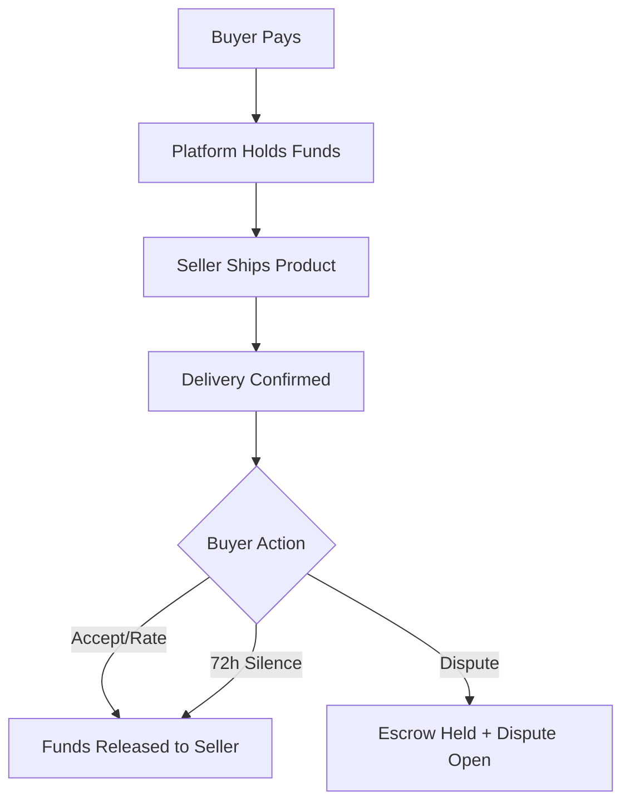
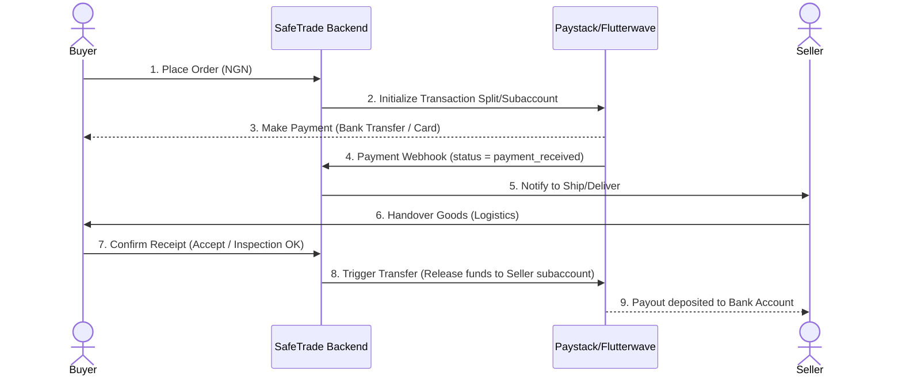

# Nigerian Market Escrow MVP: Research, Gap Analysis, & UI Roadmap

This document outlines the escrow landscape of global marketplace leaders, details the specific dynamics of the Nigerian e-commerce market, audits the technical gaps in our current codebase, and provides a clear UI/UX roadmap to build a high-trust Minimum Viable Product (MVP).

---

## 1. Global Escrow Models: How Giants Do It

To design a high-converting escrow model, we must understand how international players balance buyer security with seller cash flow:

### Platform Comparison Matrix

| Platform | Payment Holding Model | Buyer Protection Mechanism | Release Trigger |
| :--- | :--- | :--- | :--- |
| **Mercari** | true Escrow-style (Internal Ledger) | Mercari Promise (no payment to seller until buyer inspects) | Buyer leaves a positive rating, OR 72-hour auto-release after carrier-confirmed delivery. |
| **eBay** | Managed Payments / Escrow.com | eBay Money Back Guarantee (reimbursement model) / Escrow.com for high-value items ($10k+ luxury/motors) | Standard bank payouts (daily/weekly schedule) or Escrow.com inspection period completion. |
| **Etsy** | Etsy Payments Holding | Etsy Purchase Protection (automatic refund for lost/damaged goods up to $250) | Estimated delivery date passes + standard holding schedule (longer for new sellers). |
| **StockX** | Intermediary Escrow | Authentication-as-a-service | Item passes StockX physical verification (StockX acts as middleman inspector). |

### Key Takeaways for our MVP:
1. **The 72-Hour Inspection Limit (Mercari Model):** Prevents sellers' money from being held indefinitely by silent buyers. If the buyer doesn't inspect and rate/raise an issue within 72 hours of verified delivery, the transaction completes automatically.
2. **Intermediary Physical Verification (StockX Model):** Crucial for high-value items, but too logistically complex for a lean marketplace MVP. We should default to the direct C2C shipping + digital escrow hold model.

---

## 2. The Nigerian Market Context: High Trust Deficit

Entering the Nigerian e-commerce market requires addressing local realities:

*   **The Trust Gap:** The market suffers from a deep "trust deficit." Social commerce (Instagram, WhatsApp, Facebook groups) is plagued by scammers. Buyers fear **"What I ordered vs. What I got"** or paying and getting blocked (ghost vendors).
*   **The Cash-on-Delivery (COD) Trap:** To avoid scams, buyers demand COD. However, COD is a logistics nightmare for sellers due to high delivery rejection rates (buyers changing their minds, lack of cash on hand) and safety risks to delivery riders carrying cash.
*   **Payment Preferences:** **Direct Bank Transfer** is the dominant digital payment channel in Nigeria (via instant NIP, USSD, or banking apps), accounting for over 70% of digital transactions. Debit cards are secondary, and cash is still prevalent.
*   **Fintech Infrastructure:** Gateways like **Paystack** and **Flutterwave** offer robust APIs for **Split Payments** (routing parts of a payment to subaccounts) and **Transfers** (payouts to local bank accounts), making programmatic escrow settlement highly achievable.

---

## 3. Codebase Technical Gap Analysis

An audit of our current codebase reveals that while the core domain entities and state transition flows are well-structured, the payment integrations are entirely stubs.

### Codebase Inventory & Gaps

| Component | What Exists Today | What is Missing (Technical Gaps) |
| :--- | :--- | :--- |
| **Products App** | Complete catalog system: models, categories, variants, ElasticSearch documents, views, and list caching. | Fully functional. No major gaps for MVP. |
| **Transactions App** | [EscrowTransaction](file:///c:/Users/musta/fasu-marketplace/market-place/apps/transactions/models/transaction.py) model with comprehensive states (`initiated`, `payment_received`, `shipped`, `inspection`, `completed`). Centralized `EscrowTransitionService` that handles state validations. | No bank account fields exist on users to receive payouts. The transaction holds are purely digital entries; no financial engine connects them. |
| **Flutterwave App** | A stub package with empty views for `verify_payment` and `flutterwave_webhook` using `pass`. | **100% Missing:** No live payment gateway charge initiation, webhook signature verification, or split payout logic. |
| **Disputes App** | [Dispute](file:///c:/Users/musta/fasu-marketplace/market-place/apps/disputes/models.py) models, statuses (`opened`, `in_review`, `resolved_buyer`, `resolved_seller`), and API endpoints. | Needs connection to the payment refund API to trigger actual payouts upon dispute resolution. |
| **User/KYC App** | Profiles with `identity_verified` and `phone_verified` boolean flags. | **Missing Verification Services:** No connection to BVN/NIN verification APIs (such as smile identity, Monnify, or Paystack verification services) to verify seller identity. |

---

## 4. MVP Core Focus Areas & Implementation Plan

To build a secure, functional MVP for the Nigerian market, we should focus on the following integrations:

### Phase 1: Seller Payout Setup
*   **What to add**: Add fields to the seller profile to capture bank account details: `bank_name`, `bank_code`, `account_number`, and `account_name`.
*   **How**: Use Paystack's **Resolve Account** API (`GET https://api.paystack.co/bank/resolve`) on the backend to verify that the account details match the seller's registered name before saving, preventing fat-finger errors and transfer fraud.

### Phase 2: Paystack / Flutterwave Escrow Flow
*   **How payment works**:
    1. When a buyer initiates a checkout, the backend calls the Payment Gateway's **Initialize Transaction** API.
    2. We set up the payment to hold the money. In Nigeria, this is best achieved by initializing the transaction under the Platform's merchant account (holding the funds in the platform's gateway balance).
    3. The buyer pays using **Direct Bank Transfer** (via virtual account numbers generated on checkout) or **Debit Card**.
    4. The gateway triggers our webhook when the payment is successful. Our webhook moves the transaction status to `payment_received`.
*   **How payout release works**:
    1. Once the buyer clicks **Confirm Delivery** (or the inspection period expires), we transition the transaction status to `completed` and `funds_released`.
    2. The backend triggers a **Transfer** API call to payout the seller's share (less platform fees) directly to their verified bank account.

### Phase 3: Seller Identity Verification (Trust Badges)
*   **Trust Mechanism**: Sellers must verify their identity to sell. Connect a lightweight KYC API (like Paystack's Identity Verification or a dedicated service like Smile ID) to resolve the seller's **NIN (National Identification Number)** or **BVN (Bank Verification Number)**. Once verified, display a **"Verified Seller"** badge on their store and products.

---

## 5. UI/UX Recommendations (What, How, Why)

To overcome the Nigerian e-commerce trust deficit, the UI must feel secure, transparent, and responsive:

### 1. The Escrow Progress Tracker (On Transaction Details)
*   **What**: A visual stepper displaying: `Funds Secured` ➔ `Shipped` ➔ `Delivered` ➔ `In Inspection` ➔ `Funds Released`.
*   **How**: Highlight the current state with a distinct theme (e.g., green for positive states, yellow for inspection/dispute). Display a helper text under each step (e.g., under *Funds Secured*: *"Money is held safely by SafeTrade. The seller cannot withdraw it until you receive and verify the item."*).
*   **Why**: Builds buyer confidence by visually confirming that their money is not in the seller's hands yet.

### 2. Double-Confirmation "Mark as Received" Button
*   **What**: When the buyer clicks "Confirm Receipt", show a popup alert warning: *"Are you sure you have received and inspected the item? Clicking confirm will immediately release NGN X,XXX to the seller. This action cannot be reversed."*
*   **How**: Force the user to check a checkbox confirming they have inspected the product before the submit button becomes active.
*   **Why**: Prevents accidental releases and educates the buyer on their inspection rights.

### 3. Integrated Live Chat with Transaction Alerts
*   **What**: A chat room where buyers and sellers discuss details. Integrate system event banners directly into the chat thread (e.g., *"System: Payment confirmed. Seller, please ship the item."* or *"System: Buyer reported item shipped."*).
*   **How**: Use WebSockets (already structured in `apps/chat/`) to push system notifications inside the chat workspace.
*   **Why**: Contextualizes communication and keeps all transaction agreements within the platform in case a dispute is raised.

### 4. Dedicated Dispute Raising Modal
*   **What**: A button visible during the inspection period: *"Open Dispute / Report Issue"*. Clicking it opens a modal allowing the buyer to upload photo/video proof, select a reason (e.g., "damaged", "wrong item"), and provide details.
*   **How**: Transition the escrow status to `disputed` immediately, pausing any auto-release timers, and logging the dispute history.
*   **Why**: Assures the buyer that they have recourse if the product is substandard, neutralizing the risk of "What I ordered vs. what I got."
